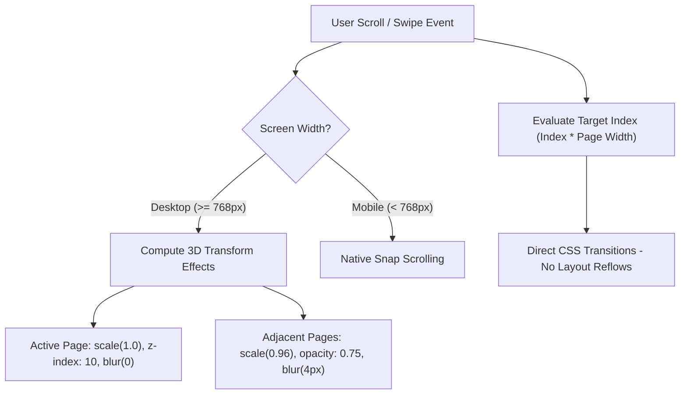
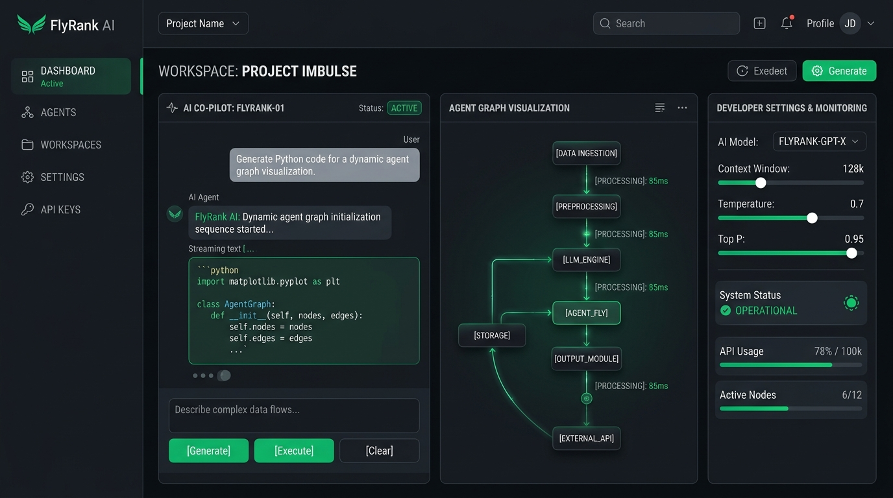

# 🌌 Premium 3D Interactive Developer Portfolio

Welcome to the official repository for **Nimra Shehzadi's 3D Interactive Developer Portfolio**. This is a premium, cutting-edge single-page web experience featuring smooth 3D parallax scroll physics, interactive card rotators, custom modular lightboxes, and a responsive 3D Coverflow certifications gallery.

---

## 📊 Project Visuals & Architectural Layouts

### 1. 3D Coverflow Slider Deck Architecture (ASCII Representation)
The certifications section is styled as a 3D Coverflow deck slider. Non-focused adjacent cards rotate along the Y-axis and sit behind the active card, hiding their information cards to avoid visual text collision.

```text
                  ┌───────────────────────────────┐
                  │    [Center Active Card]       │
                  │       (Scale: 1.0)            │
                  │       (Opacity: 1.0)          │
                  │  ┌─────────────────────────┐  │
                  │  │                         │  │
                  │  │    CERTIFICATE IMAGE    │  │
                  │  │                         │  │
                  │  ├─────────────────────────┤  │
  ┌───────────────┼──│   Title & Issuer Text   │──┼───────────────┐
  │ [Left Card]   │  │   [View Certificate]    │  │ [Right Card]  │
  │ (Scale: 0.82) │  └─────────────────────────┘  │ (Scale: 0.82) │
  │ (Rotated +25°)│                               │ (Rotated -25°)│
  │ (Text Hidden) │                               │ (Text Hidden) │
  └───────────────┘                               └───────────────┘
  [translateX(-160px)]                           [translateX(160px)]
```

### 2. 3D Scroll Physics Engine Flow
This flowchart represents how scrolling events map to horizontal layout snaps and dynamic 3D scaling transformations:



### 3. Technology Stack Allocation Graph
This text-based graph represents the distribution of codebase components and logic:

```text
Styling & CSS Transforms  ██████████████████████████████████████ 45%
JS Scroll & Swipe Engine  ████████████████████████████ 35%
HTML5 Markup / Structure  ████████████████ 20%
```

---

## ✨ Features & Highlights

### 1. Unified 3D Scrolling Layout
* **Horizontal Snapping Views**: Implements a smooth, page-by-page horizontal viewport snapping engine.
* **Scroll-Driven 3D Transforms**: Dynamically scales and layers active and adjacent sections (`scale`, `translateZ`, `rotateY`) in 3D perspective space based on page coordinates.
* **Zero-Reflow Performance**: Computes scroll offsets using direct page indices instead of reading layout values (`.offsetLeft`), eliminating layout thrashing and delivering a buttery-smooth 60fps experience.

### 2. Interactive 3D Widgets
* **Domain Rotator (Skills Section)**: A circular 3D carousel that rotates skill categories in cylindrical coordinates.
* **Flip-Cards (About Section)**: Premium double-sided info cards that rotate on hover with smooth 3D transitions.

### 3. Upgraded 3D Coverflow Certifications Gallery
* **Single-Card Focal Point**: Displays the active certificate in the center at 100% scale and full opacity. Adjacent cards stack back in 3D depth and Y-axis rotation on the sides.
* **Zero Text Overlapping**: Side certificate details are cleanly hidden (`opacity: 0`), and slide-in/fade-in transitions trigger *only* for the active card, ensuring a neat and readable layout.
* **Mouse Drag & Touch Swipe**: Supports desktop mouse dragging (with dynamic `grab`/`grabbing` cursor swaps) and mobile touchscreen swiping gestures with a horizontal threshold.
* **Click-to-Select**: Clicking on a visible side card rotates the carousel to focus and select that card.

### 4. Custom Lightbox Modal
* **Media-Aware Modal Viewports**: Opens certificate previews and document viewers in a high-fidelity modal view with clean layout-preservative close options.
* **Fallback Image Safety**: Automatically switches broken image links to fallback assets on error.

### 5. Responsive Optimization
* **Fluid Layout (Desktop 100% Zoom)**: Scales container widths, typography ratios, grid offsets, and hero visual containers proportionally on viewports `>= 1400px` to naturally fill high-res displays.
* **Compact Mobile Adaptation**: Hides side-card clutter on screens `<= 768px` to focus on a single active card, preventing horizontal body spills.

---

## 🛠️ Technology Stack

* **Frontend Structure**: HTML5 (Semantic elements, modern icon integrations)
* **Styling & Presentation**: CSS3 (Custom properties, 3D perspective layouts, Flexbox grids, media queries)
* **Behavior & Physics**: JavaScript (ES6+ Vanilla JS, touch/mouse drag state machines, CSS transform controllers)
* **Iconography**: FontAwesome Icons

---

## 📁 Repository Structure

```
├── public/
│   ├── certificates/       # High-resolution certificate images
│   └── images/             # Profile pictures and assets
├── images/
│   └── hero_woman.png      # Hero landing character image (newly updated)
├── index.html              # Primary entry HTML document
├── style.css               # Core layout and 3D visual styling
├── script.js               # Physics scroll engines and carousel state machines
└── README.md               # This repository documentation
```

---

## 🚀 Getting Started

### Prerequisites
A basic web server to serve the static assets and enable modules (optional but recommended for absolute resource routing).

### Quick Setup

1. **Clone the Repository**:
   ```bash
   git clone https://github.com/Nimra-shehzadi/new-3d-portfolio.git
   cd new-3d-portfolio
   ```

2. **Run a Local Server**:
   * Using Python (recommended):
     ```bash
     python -m http.server 3000
     ```
   * Using Node.js `live-server` or `serve`:
     ```bash
     npm install -g serve
     serve -p 3000
     ```

3. **View the Website**:
   Open your browser and navigate to `http://localhost:3000`.

---

## 🎨 Theme, Colors & Typography

### 🔴 Color Scheme Palette
We utilize a dark cyberpunk palette to achieve a modern, premium aesthetic:

| Color Role | Hex Code | Visual Swatch | Emojis |
| :--- | :--- | :--- | :--- |
| **Deep Dark Background (Base)** | `#050206` | `` | ⬛🌌 |
| **Neon Magenta Accent (Highlights/Active)** | `#FF2B8A` | `` | 🟥💖 |
| **Deep Purple Accent (Theme/Curves)** | `#9B5CFF` | `` | 🟪💜 |
| **Card Borders / Hover Backgrounds** | `#1a0e1b` | `` | 🟫🪵 |
| **Primary Text Color** | `#f8fafc` | `` | ⬜✉️ |

* **Primary Fonts**: Modern sans-serif stacks featuring heavy geometric headings (`Outfit`) and clean, readable monospace details (`JetBrains Mono`).

---


#### 3. Low-Level Development & Systems
* **FlyRank**: High-performance sorting simulator.
  
